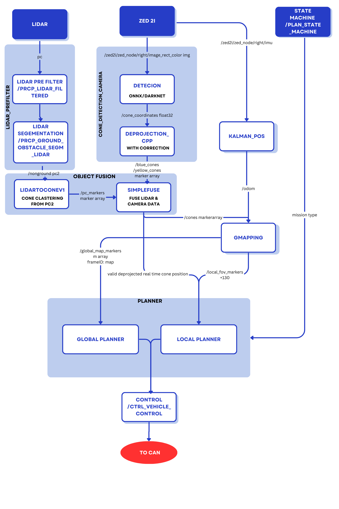

# Formula Student Driverless - developed by University of Gyor

## Proposed system architecture
The proposed system architecture is shown below. The following considerations are made for each component:
- `state machine`: base logic of szenergy bringup is taken over, with slight modifications to FS rules; output topic includes both state and mission ID, and mission ID is set manually (external source or parameter in accordance with FS rules)
- `object detection`: two parallel solutions are implemented, later either of these or the combination (fusion) is used, to be decided later,
- `object fusion`: if e.g., only lidar detection is used, fusion is unnecessary and can be deleted,
- `map creation` includes `SLAM`
- `trajectory planner` receives the raw object list and plans path based on it (e.g., first round of trackdriver, acceleration) and also received the map from the `slam`, where global trajectory is planned; this switching is handled inside the planner,
- `control` in the first place is a simple take-over of the szenergy solution, later it is planned to be changed to handle high speed handling.

All components are to be developed in ROS 2 Humble.




```mermaid
flowchart TD
    S[State Machine <br>/plan_state_machine] -.->|/plan_state*| LP[LIDAR pre filter<br>/prcp_lidar_filtered]
    LP --> LS[LIDAR segementation<br>/prcp_ground_obstacle_segm_lidar]
    S -.-> CS[Cone detection camera<br> and de-projection]
    S -.-> O[Object fusion]
    CS -->|/prcp_obj_list_camera| O
    LS -->|/prcp_obj_list_lidar| O
    O -->|/prcp_obj_list_fused| T[Trajectory planner<br>/plan_trajectory_planner]
    T --> C[Control<br>/ctrl_vehicle_control]
    S -.-> T
    S -.-> C
    O --> M[Map Creation<br>/prc_slam]
    M -->|/prcp_map| T
    L[Localization<br>/prcp_odometry_kf_prediction] --> T
    C --> CAN[To CAN]
    classDef light fill:#34aec5,stroke:#152742,stroke-width:2px,color:#152742  
    classDef dark fill:#152742,stroke:#34aec5,stroke-width:2px,color:#34aec5
    classDef white fill:#ffffff,stroke:#152742,stroke-width:2px,color:#15274
    classDef dash fill:#ffffff,stroke:#152742,stroke-width:2px,color:#15274, stroke-dasharray: 5 5
    classDef red fill:#ef4638,stroke:#152742,stroke-width:2px,color:#fff
    class CS,LS,LP,L,T,M,C white
    class O light
    class S dash
    class CAN red
 ``` 


# Clone and build

[](https://docs.ros.org/en/humble/)

## Clone

``` bash
cd ~/ros2_ws/src
```

``` bash
git clone https://github.com/szenergy/formula_student_packages
```

## Build

``` bash
sudo apt install ros-humble-pcl-ros
```

``` bash
cd ~/ros2_ws 
```

``` bash
colcon build --symlink-install --packages-select formula_student_bringup cone_detection_lidar cone_detection_camera lidar_pre_filter
```

## Run
 
``` bash
source ~/ros2_ws/install/setup.bash 
```
E.g:
``` bash
ros2 launch formula_student_bringup tf_static.launch.py
```
``` bash
ros2 launch cone_detection_lidar detection_simple.launch.py
```

## Directory structure

> [!CAUTION]
> If you move the packages to another directory, you need delete the build and install directories and rebuild the packages.

``` r
~/ros2_ws/src/
    ├── formula_student_packages # this repo
    │   ├── cone_detection_lidar
    │   │   ├── launch
    │   │   └── src
    │   ├── formula_student_bringup
    │   │   └── launch
    │   ├── other fs package1
    │   ├── other fs package2
    │   └── img
    └── wayp_plan_tools # other non-fs packages
        ├── csv
        ├── launch
        └── src
```
## Related packages

- https://github.com/url-kaist/patchwork-plusplus-ros/tree/ROS2
- https://github.com/jkk-research/lidar_cluster_ros2
- https://github.com/jkk-research/pointcloud_to_grid