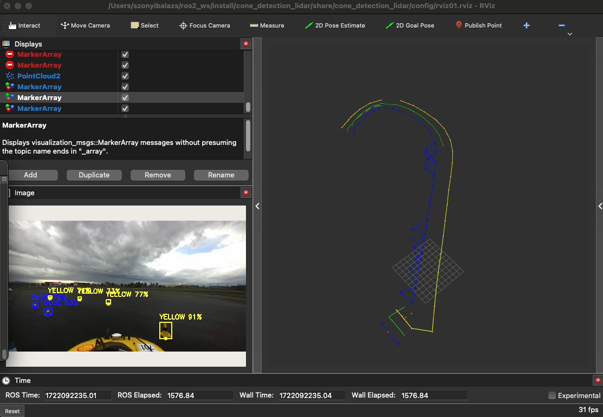

# Global mapping 🗺️📌


The code uses [markerarray]() and [odeometry]() (relative position and reorientation) topics to create a global map of the detected objects.

It can also receive and process data in [pointcloud2]() format with a small modification. It is still under development so there may be some non-functional parts and some bugs. 



## Installation

Copy the node inside the src folder to wherever you like. After that: 

```bash
colcon build --symlink-install --packages-select gmapping
source install/setup.bash 
```

## Usage
To run:
```bash
ros2 run gmapping gmapping_node
```
The global map is published to a frame named [map]() on topic [global_map_markers]() in markerarray format. 

Global variables:

By changing the constant GV, the global mapping can be made more accurate. 
```python 
self.alpha = 0.9
self.max_hits = 1000 #The maximum number of detection what the cone can achive. (Hit == number of detection.)
self.min_hits = -8 #Minimum hit, under that number, the cone will be deleted.
self.R_max_cov = 1.5 #Maximum trust. (Number of covariation. How the code trust in the position of detection.) 
self.R_min_cov = 0.1 #Minimum trust
self.freq_output = 10 #Freshrate of data output
self.delta_cov = self.R_max_cov * (self.max_hits - 1) / self.max_hits**2 
self.cone_db = np.empty((0, 7)) 
self.dist_FOV_max = 10.0 #Maximum distance of detected objects in the field of view 
self.dist_FOV_min = 1.7 #Minimum distance of detected objects in the field of view 
self.last_pose = PoseStamped()
self.freq_update_db = 10 #Freshrate of database
self.add_hit = 3 #Each time the code detects an object with a certain id again, it increases the hit value by +3.
self.sub_hit = 1 #The initial value I think 
self.angle_FOV =  #nem tudom mekkora pontosan a ZED látószöge de ennek azzal meg kéne egyeznie :)
self.angle_FOV2 = 180 #A baslink pontjára egy síkot illesztve és attól előre felé látszik minden ami globál-ban mentve van lokál koordinátákba visszaszámolva.
self.dist_FOV_max2 = 10.0 #ez a kettő adat adja meg a fov2-ben szűrt maximális és minimális távot globálból vissza koordinátákkal. 
self.dist_FOV_min2 = 0.5
self.transformed_cones = []
self.legit_cone_hits = 1000 #idk what is this number :)
self.freq_clean_db = 1 #It updates and cleans the database. 
self.id_cone = 0
self.default_x = 640113.5 #The odeometry in the mcap file starts from these values, so I subtract them to get a nice global map.  I know this is not a nice solution. 
self.default_y = 5193671.0 #The odeometry in the mcap file starts from these values, so I subtract them to get a nice global map.  I know this is not a nice solution 😌. 
self.distance = 0
```
