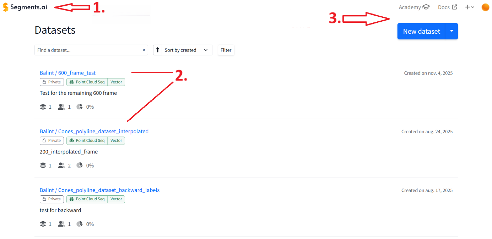

**Segments Ai használati segédlet**

Ez a segédlet a polyline címkékkel történő munkavégzést hivatott
bemutatni, így messze nem lesz a címkéző platform minden funkciója
bemutatva. Aki többet szeretne tudni a további funkciókról,
lehetőségekről, az a hivatalos dokumentációban minden további
információt megtalál: <https://docs.segments.ai/>

- A munkavégzés megkezdése előtt regisztrálni kell a Segments Ai
  platformra. Ezt mindenképpen az egyetemi email címmel kell megtenni,
  mivel akadémiai jellegű tevékenységekre ingyenes felhasználást
  biztosítanak. Lehetséges, hogy a regisztrációt követően szükség lesz
  némi időre (néhány óra, vagy 1-2 nap), míg a regisztrált címet
  ellenőrzik és megadják az igényelt hozzáférést.

- A regisztrációt követően minden adatkészletet melyhez hozzáférése van
  a felhasználónak, a bal felső sarokban található Segments.ai feliratra
  (1-es számmal jelölve) kattintva érhető el. Az adatkészletek a
  „Datasets" cím alatt kerülnek felsorolásra (2-es számmal jelölve). A
  jobb felső sarokban van lehetőség új adatkészlet létrehozására,
  illetve a dokumentumok (Docs) és oktató videók/kurzusok (Academy)
  elérésére (3-as számmal jelölve).

{width="6.3in" height="3.0625in"}

- A címkézni kívánt adatkészlet nevére kattintva lehet megtekinteni az
  adott adatok beállításait, definiált osztályait. A címkézési
  folyamatot a „Start labeling" gombra kattintva lehet megkezdeni.

{width="6.3in"
height="2.4722222222222223in"}

- A „Settings" pont alatt, a „Labeling" menüben található a „enable
  interpolation" opció. Ez a már lerakott címkéket átviszi a következő
  framekre, és az ego pozícióban bekövetkezett elmozdulással megegyezően
  transzformálja őket.\
  (**Nem tökéletes, mindig igazításra szorul.**)

- A címkézés megkezdésekor a következő képhez hasonló kezelőfelület lesz
  látható.

{width="6.3in" height="2.875in"}

- A kezelőfelület nagyrészét a címkézni kívánt adat, a képen látható
  esetben egy pontfelhő fedi le. A kamera nézetet a „ctrl+bal egér gomb"
  kombináció nyomvatartásával tudjuk egyenes vonal mentén mozgatni, míg
  „shift+bal egér gomb" kombinációval forgatni tudjuk a nézőpontot.

- A bal felső sarokban tudunk a különböző címkézési opciók közül
  választani.\
  (A legalsó a polyline)

- A képernyő alján látható számozáson tudjuk nyomon követni mely framet
  címkézzük éppen.

- A jobb oldali függőleges sáv a „Settings" menüpont alatt, változatos
  funkciókat kínál az adat kijelzésével kapcsolatosan. Ezek közül néhány
  melyek hasznosak lehetek:

  - **Point size:** Ezzel a csúszkával állítható a pontfelhőt alkotó
    pontok mérete, egyes esetekben javíthatja a láthatóságot.

  - **Object coloring:** Két lehetőség közül a „By category"-ra legyen
    állítva, hogy az objektumokat osztályok alapján színezze.

  - **Gradient:** A számunkra legmegfelelőbb színskálát lehet
    kiválasztani.

  - **Min/Max értékek:** A z-tengely mentén figyelembe vett tartományt
    lehet vele állítani. Azon értékek melyek ezen az intervallumon kívül
    esnek, nem kerülnek megjelenítésre. Jelen adatkészlet esetében a
    -0,5-0,5-ös intervallumot találtam a leghatékonyabbnak, mivel
    valamilyen kiemeli a bóják hegyét.

{width="5.417135826771654in"
height="2.350203412073491in"}

- A jobb oldali függőleges sáv „Labeling" pontja alatt minden eddig
  letett címke látható lesz, és minden újonnan beillesztett címkének az
  osztályát manuálisan kell kiválasztani a megadott lehetőségek közül.
  **(Kivétel amik interpoláció miatt már ott vannak az új framen, azokat
  csak igazítani kell a pontfelhőn!!!)**

- Az elkészült munkát a jobb felső sarokban található „Save" gombbal
  tudjuk menteni. Érdemes időnként megtenni, nehogy egy óvatlan kilépés,
  vagy áramszünet miatt elvesszen az addigi munka.

**Címkézési követelmények**

A címkézés követelményei viszonylag egyszerűek:

- Négy osztály lesz az adatkészlezben definiálva, Left_Border_1,
  Right_Border_1, Left_Border_2, Right_Border_2. Az 1-es indexűek mindig
  az a szakasz amiben vagyunk (mindig az előrefele tartó), a 2-es
  indexűek pedig a szembejövő sávot keretezik (így mikor az autó a
  kanyarban visszafordul, az addig 1-es indexű 2-es indexű lesz, az
  addig 2-es pedig 1-es).

- Az 1-es és 2-es indexű címkék **NE** érjenek össze, még akkor sem, ha
  már tiszta összeköttetés van közöttük. Ilyen esetekben egyértelmű
  szakadás válassza el a kettő címkét.

- Nem gond ha néhány frameig, nincs minden osztályból letéve egy címke.
  Lesz amikor csak 1-es indexűekre lesz szükség.

- Egy osztályból csak egy címke legyen letéve. Amennyiben a bóják vonala
  szakadozottnak tűnik, úgyis jelölhetjük egy darab egybefüggő görbével,
  tudván hogy az adott helyen bóják futnak.
