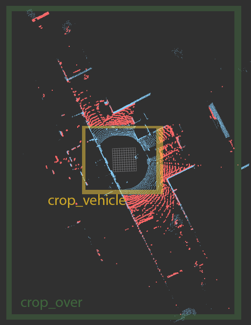

# `lidar_pre_filter` ROS 2 package 

[](https://docs.ros.org/en/humble/)

## Parameters

| Parameter    | Value e.g. | Description |
|--------------|-------|-------------|
| `cloud_in_topic`  | `/cloud` | Pointcloud to process |
| `verbose1`  | `true` | More log info |
| `verbose2`  | `true` | More log info |
| `minX_over`  | -220.0| Outer crop box minX_over |
| `maxX_over`  | 220.0 | Outer crop box maxX_over |
| `minY_over`  | -220.0| Outer crop box minY_over |
| `maxY_over`  | 220.0 | Outer crop box maxY_over |
| `minZ_over`  | -10.0 | Outer crop box minZ_over |
| `maxZ_over`  | -0.05 | Outer crop box maxZ_over |
| `minX_vehicle` | -2.0 | Negative vehicle filter minX_vehicle |
| `maxX_vehicle` | +2.0 | Negative vehicle filter maxX_vehicle |
| `minY_vehicle` | -2.0 | Negative vehicle filter minY_vehicle |
| `maxY_vehicle` | +2.0 | Negative vehicle filter maxY_vehicle |




## Run

``` bash
ros2 launch lidar_pre_filter filter_vehicle01.launch.py topic:=/lexus3/os_center/points
```