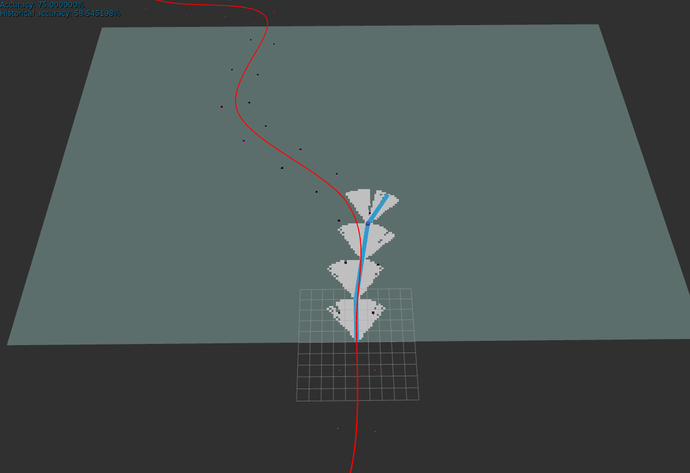

# Racetrack Simulator
Racetrack simulator for `ROS 2` `Humble`

[](https://docs.ros.org/en/humble/)

This package contains two ROS 2 nodes designed for a simulated racetrack environment: LidarConeSim and AccuracyMeter. The LidarConeSim node generates and publishes simulated lidar point cloud data of cones around a circular (random generated) track. The AccuracyMeter node evaluates the accuracy of predicted points against a given racetrack centerline.

 

## Dependencies
- ROS 2 Humble
- PCL (Point Cloud Library)
- C++ 17
- [rviz_2d_overlay_plugins](https://github.com/teamspatzenhirn/rviz_2d_overlay_plugins)


## Building
Install rviz_2d_overlay_plugins:
```bash
sudo apt install ros-humble-rviz-2d-overlay-plugins
```

In the following commands `~/ros2_ws` is assumed to be the ROS 2 workspace:

```bash
cd ~/ros2_ws/src
```

```bash
git clone https://github.com/link
```

```bash
cd ~/ros2_ws
```

Build with

```bash
colcon build --packages-select racetrack_simulator --symlink-install
```

<details>
<summary> Don't forget to source before ROS commands.</summary>

``` bash
source ~/ros2_ws/install/setup.bash
source /opt/ros/humble/setup.bash
```
</details>

## Nodes
### 1. `LidarConeSim` Node
This node simulates a racetrack with cones and publishes the lidar point cloud data of the cones and the racetrack centerline.

#### Parameters
| Parameter                 | Type    | Description                                                                 |
|---------------------------|---------|-----------------------------------------------------------------------------|
| `track_keypoints`         | int     | Number of keypoints for generating the track.                               |
| `track_radius`            | int     | Radius of the track.                                                        |
| `track_distortion`        | double  | Distortion factor for the track.                                            |
| `num_interpolated_points` | int     | Number of interpolated points for the track.                                |
| `cone_spacing`            | double  | Spacing between cones.                                                      |
| `cone_distance`           | double  | Distance of cones from the track centerline.                                |
| `update_frequency`        | int     | Update frequency for publishing data.                                       |
| `lidar_frame`             | string  | Frame ID for the lidar data.                                                |
| `track_pointcloud_topic`  | string  | Topic name for publishing the track point cloud.                            |
| `centerline_topic`        | string  | Topic name for publishing the racetrack centerline.                         |
| `seed`                    | int     | Seed for random number generation.                                          |
| `visible_pointcloud_topic`| string  | Topic name for publishing the visible point cloud.                          |
| `crop_minX`               | double  | Minimum X value for cropping the point cloud, for generating the visible point cloud. |
| `crop_maxX`               | double  | Maximum X value for cropping the point cloud, for generating the visible point cloud. |
| `crop_minY`               | double  | Minimum Y value for cropping the point cloud, for generating the visible point cloud. |
| `crop_maxY`               | double  | Maximum Y value for cropping the point cloud, for generating the visible point cloud. |
| `noise_num_points`        | int     | Number of noise points added outside of the track.                          |
| `noise_radius`            | double  | Radius of the noise points.                                                 |

#### Topics
| Topic                  | Type                                  | Description                           |
|------------------------|---------------------------------------|---------------------------------------|
| `/nonground`           | `sensor_msgs/msg/PointCloud2`         | Publishes the lidar point cloud data. |
| `/racetrack_centerline`| `visualization_msgs/msg/MarkerArray`  | Publishes the racetrack centerline.   |
| `/visible_points`      | `sensor_msgs/msg/PointCloud2`         | Publishes the visible point cloud data. |

### 2. `AccuracyMeter` Node
This node evaluates the accuracy of predicted points against a given racetrack centerline and publishes the accuracy information.

#### Parameters
| Parameter               | Type    | Description                              |
|-------------------------|---------|------------------------------------------|
| `centerline_topic`      | string  | Topic name for the centerline data.      |
| `predicted_points_topic`| string  | Topic name for the predicted points data.|
| `verbose`               | bool    | Verbose logging.                         |
| `overlay_text_topic`    | string  | Topic name for the overlay text data.    |
| `accuracy_treshold`     | double  | Threshold for accuracy calculation.      |

#### Topics
| Topic                | Type                                 | Mode       | Description                        |
|----------------------|--------------------------------------|------------|------------------------------------|
| `/debug_marker`      | `visualization_msgs/msg/MarkerArray` | Subscribes | Subscribes to the predicted points data. |
| `/racetrack_centerline` | `visualization_msgs/msg/MarkerArray` | Subscribes | Subscribes to the racetrack centerline data. |
| `/overlay_text`      | `std_msgs/msg/String`                | Publishes  | Publishes the accuracy information. |

## Usage
To run the nodes, use the provided launch files:

```bash
ros2 launch racetrack_simulator lidar_cone_sim.launch.py
ros2 launch racetrack_simulator accuracy_meter.launch.py
```